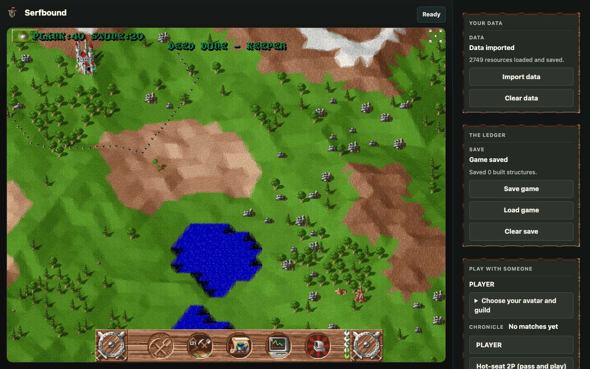
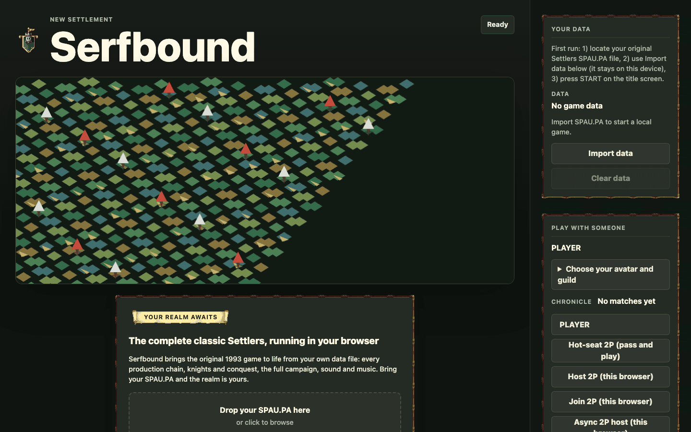
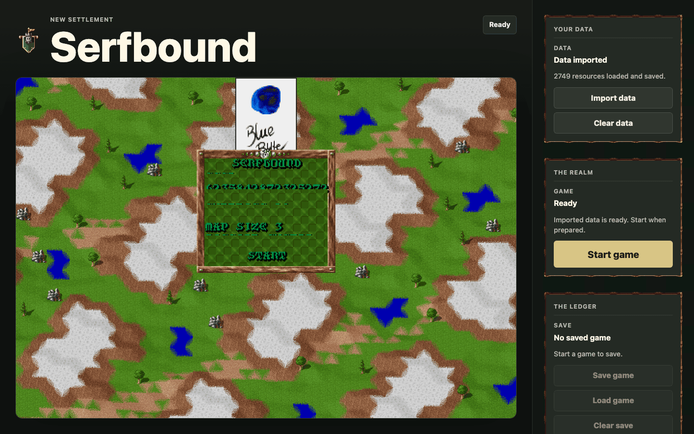
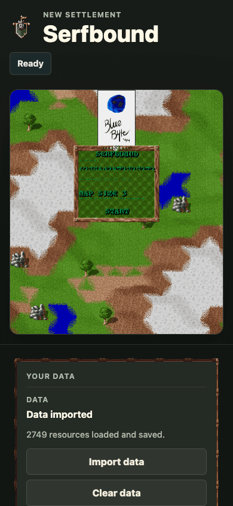

# Serfbound

[](https://github.com/karolswdev/serfbound/actions/workflows/ci.yml)

**The complete classic Settlers, running in your browser — play it now
at [serfbound.com](https://serfbound.com).**

A faithful, pure-browser remake of **The Settlers I / Serf City: Life
is Feudal** (Blue Byte, 1993) — TypeScript, WebGL2, and WebAudio, with
no servers required to play. Today, bring your own original data file
(`SPAU.PA`) and the whole game comes to life: the original world,
every production chain, knights and conquest, the 1993 interface
decoded pixel-for-pixel from your data.



**Your imported game data never leaves your machine.** Serfbound never uploads
your local `SPAU.PA`. A separate licensed converted-package path is now
documented in [LICENSE-CONSENT.md](LICENSE-CONSENT.md): configured releases can
download a browser-native converted package once, verify it, cache it locally,
and keep the import-your-own-data path first-class. Online identity is optional:
Serfbound stores only the credential data required for the sign-in method you
choose and the public name you play under; local play never needs an account,
and your game data never uploads.

## What's inside

Everything below is shipped and end-to-end tested — every claim maps
to an evidenced delivery phase in
[`pm/roadmap/serfbound/`](pm/roadmap/serfbound/).

**The complete classic game**
- The original world generator, tile-for-tile against reference
  fixtures — seeded, scrollable, wrapping.
- Every production chain of the classic economy, running concurrently
  without deadlock; demand-driven dispatch and food-gated mining.
- Knights, territory, and conquest with the exact reference combat
  math — games are won and lost.
- The original interface, decoded from your data: the game font,
  icons, panel bar, popups, minimap, notifications, and the start
  screen with the real logo.
- Sound effects and music from your own files through WebAudio —
  byte-exact clip conversion, XMI music playback.
- The 31-mission campaign, classic AI opponents, and original DOS
  savegame import.
- English and German, rendered in the original glyphs.

**Born in the browser**
- Installable offline PWA; once your data is in, no network is ever
  needed to play.
- Touch play with gestures, native-resolution view scales, high-DPI
  sharp.
- ~2M ticks/s simulation headroom; the full game in a static page.

**Play together (every mode optional)**
- Hot-seat pass-and-play and two-tab async matches — zero servers.
- Realtime two-player lockstep.
- Online correspondence at [serfbound.com](https://serfbound.com):
  optional identity (device-key sign-in today as the legacy bridge; identity v2
  retires device keys after one-time standing migration and uses
  email/password, Apple/Google/Meta, or passkeys), a challenge lobby keyed by
  challenger identity, trustless turn windows where your client re-verifies
  every move, and a dual-attested Elo ladder. Pick an avatar and a guild banner;
  earn deeds drawn from your own decoded icons.

| The welcome | The title screen | On the move |
|---|---|---|
|  |  |  |

## Play

1. Open **[serfbound.com](https://serfbound.com)** (or build locally —
   see Development).
2. Import your `SPAU.PA` — from your own copy of the game; the demo
   version's file works too. Drop it on the welcome screen.
3. START. The [player guide](docs/player-guide.md) covers everything:
   controls, keyboard/touch play, saves, sound, offline play, and the
   multiplayer modes. Tip: `?seed=` in the URL (16 digits, 1–8) pins
   the world.

## Development

Node version per `.nvmrc`.

```bash
npm install
npm test                 # unit + browser e2e (data-free)
npm run ci:release       # the full release gate set
npm run build:web        # static artifact in dist/
```

The [developer guide](docs/developer-guide.md) covers the package
boundaries, the opt-in real-data tests, and the delivery process. The
[contributor guide](CONTRIBUTING.md) covers first setup, the PMO
contract hook, issue/PR templates, and the asset boundary. This
project is delivered through the PMO roadmap at
[`pm/roadmap/serfbound/`](pm/roadmap/serfbound/) — every shipped story
carries evidence. (Heavy visual-evidence artifacts from earlier phases
remain in the archive repository noted below.)

The screenshots above (and the repository's social preview,
docs/media/social-preview.png) regenerate deterministically from one
recorded seed via `npm run capture:readme:media` (opt-in, real local
data; see `pm/roadmap/serfbound/adoption/gameplay-media-decision.md`);
`npm run check:media` enforces reference integrity and the size budget
in CI.

## Lineage and license

Serfbound is **GPL-3.0** (see [LICENSE](LICENSE)). It is a
browser-native reimplementation derived from the behavior of
[freeserf.net](https://github.com/Pyrdacor/freeserf.net) (C#), itself
derived from [freeserf](https://github.com/freeserf/freeserf) (C) —
the exact game rules, tables, formats, and layouts were ported from
those GPL projects against real-data and fixture parity tests, and the
code cites the upstream files it preserves. Serfbound's own development
history before this repository lives in the archive at
[karolswdev/freeserf.net](https://github.com/karolswdev/freeserf.net).

The Settlers is a trademark of its respective owners. This project is
an unaffiliated preservation effort; it requires data files from a copy
of the original game. The screenshots in this README depict art decoded
at runtime from the maintainer's own legally obtained data files.
